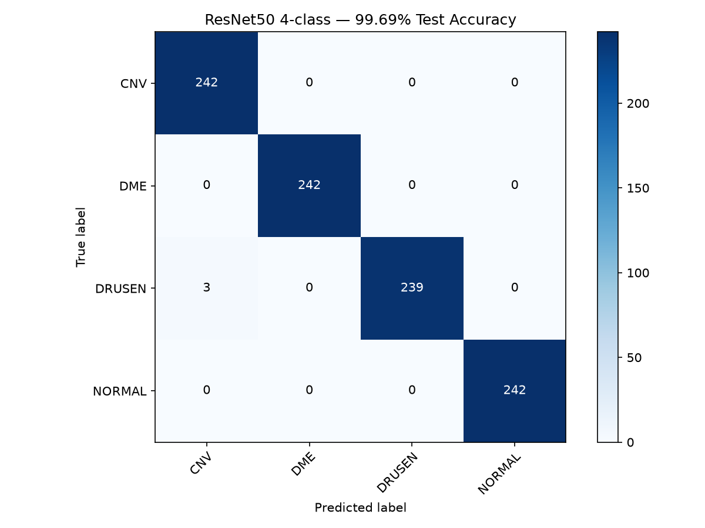
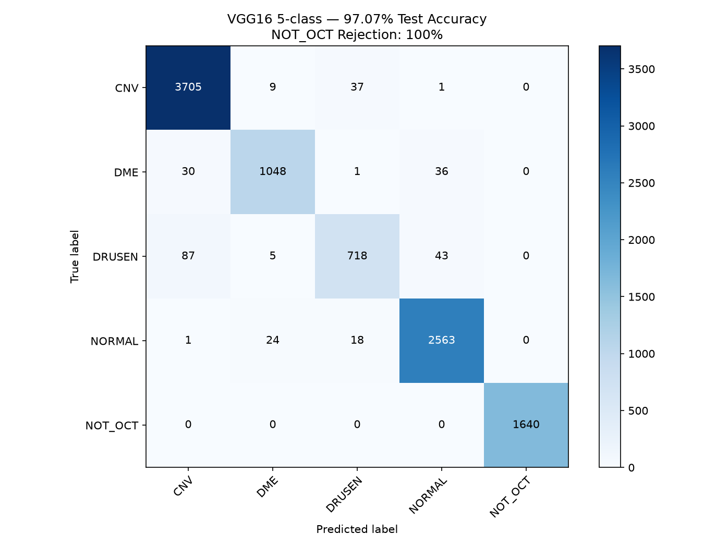
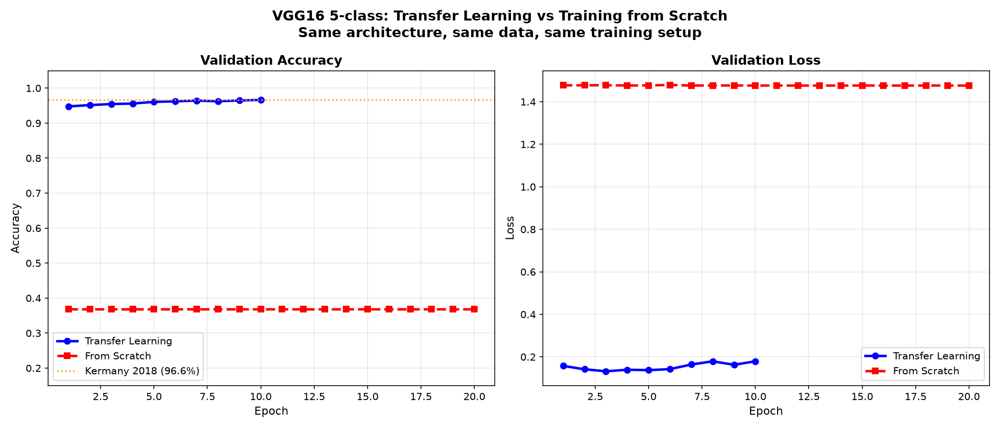
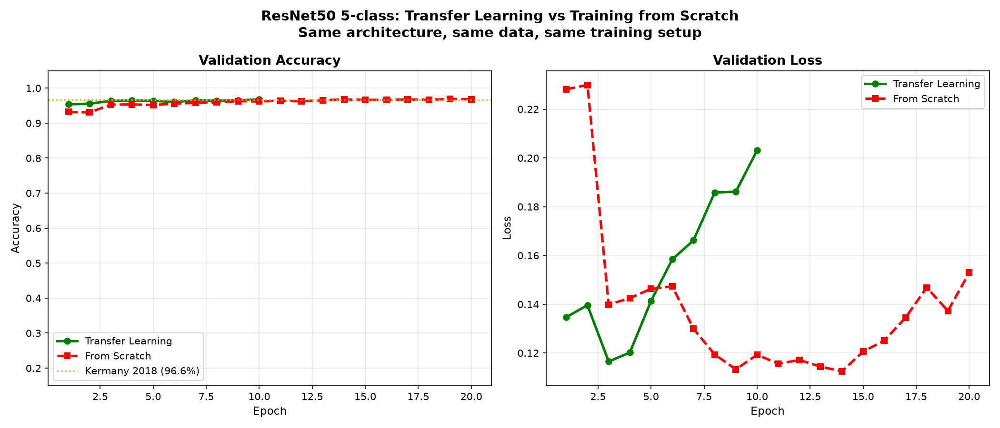
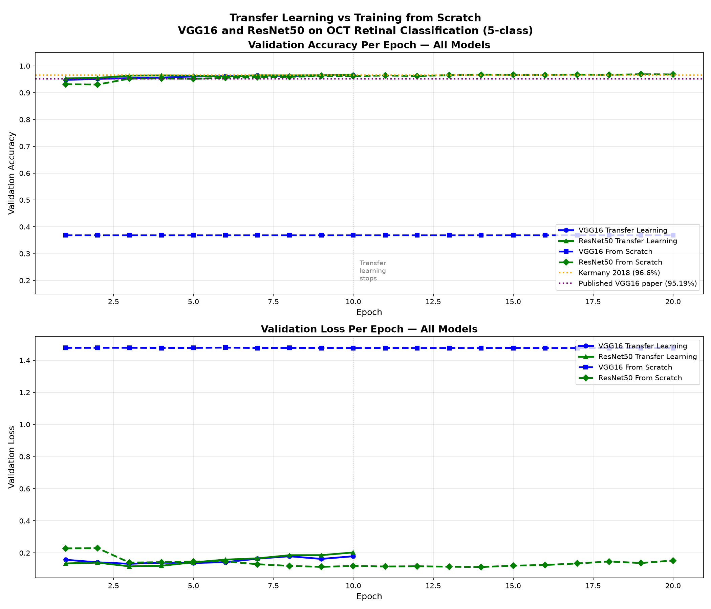
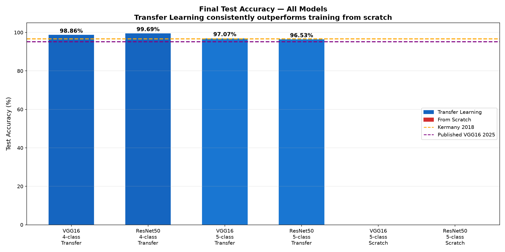

# OCT Retinal Disease Classifier
### Transfer Learning for Medical Image Classification
**SJSU AI HUB Internship Research Project**

Deep learning pipeline for classifying OCT retinal scans using transfer
learning on VGG16 and ResNet50 pretrained on ImageNet. Includes
out-of-distribution detection (NOT_OCT rejection) and a full comparison
between transfer learning and training from scratch.

---

## Research Summary

This project investigates the application of transfer learning to OCT
retinal image classification. We compare VGG16 and ResNet50 architectures
across four experimental conditions:

1. **4-class classification** — CNV, DME, DRUSEN, NORMAL
2. **5-class classification** — adds NOT_OCT rejection class
3. **Transfer learning** — pretrained ImageNet weights, selective unfreezing
4. **From scratch** — random weight initialization, all layers trainable

---

## Final Results

### 4-class Models (OCT classification only)

| Model | Test Accuracy | Correct | Notes |
|-------|--------------|---------|-------|
| Kermany et al. 2018 (paper) | 96.60% | — | Inception-v3 |
| Published VGG16 paper (2025) | 95.19% | — | Transfer learning |
| **VGG16 Transfer Learning** | **98.86%** | 957/968 | Block5 unfrozen |
| **ResNet50 Transfer Learning** | **99.69%** | 965/968 | Layer4 unfrozen |

### 5-class Models (OCT + NOT_OCT rejection)

| Model | Test Accuracy | NOT_OCT Rejection | Notes |
|-------|--------------|-------------------|-------|
| **VGG16 Transfer Learning** | **97.07%** | **100%** | Block5 unfrozen |
| **ResNet50 Transfer Learning** | **96.53%** | **100%** | Layer4 unfrozen |
| VGG16 From Scratch | TBD | TBD | 20 epochs, no pretrained weights |
| ResNet50 From Scratch | TBD | TBD | 20 epochs, no pretrained weights |

### Per-Class Accuracy (5-class Transfer Learning)

| Class | VGG16 | ResNet50 | Clinical Significance |
|-------|-------|----------|-----------------------|
| CNV | 98.7% | 97.5% | Choroidal Neovascularization |
| DME | 94.0% | 94.3% | Diabetic Macular Edema |
| DRUSEN | 84.2% | 85.8% | Hardest class — visually subtle |
| NORMAL | 98.3% | 97.4% | Healthy retina |
| NOT_OCT | **100%** | **100%** | Perfect rejection both models |

## Results Visualizations

### Confusion Matrices

#### VGG16 4-class (98.86%)


#### ResNet50 4-class (99.69%)


#### VGG16 5-class (97.07%) — with NOT_OCT rejection


#### ResNet50 5-class (96.53%) — with NOT_OCT rejection


### Transfer Learning vs From Scratch

#### VGG16 — Transfer Learning vs Scratch


#### ResNet50 — Transfer Learning vs Scratch


#### All Models — Training Curves


#### Final Accuracy Comparison

### Key Findings

1. **Both architectures beat published benchmarks** via transfer learning
2. **NOT_OCT rejection is 100%** regardless of architecture
3. **DRUSEN is consistently the hardest class** — shares visual features
   with both NORMAL retinas and early CNV (clinically expected)
4. **Transfer learning starts at ~93% epoch 1 vs ~20% from scratch**
   — the core demonstration of transfer learning's value
5. **Architecture matters less than training setup** — ResNet50 wins on
   4-class, VGG16 wins on 5-class, gap is small

---

## Experiment Log

| Run | Model | Weights | Classes | Test Accuracy |
|-----|-------|---------|---------|---------------|
| 1 | Mooney Kaggle notebook | ImageNet | 4 | 91.7% |
| 2 | VGG16 frozen, lr=0.001 | ImageNet | 4 | 83.1% |
| 3 | VGG16 frozen, lr=0.003 | ImageNet | 4 | 74.3% |
| 4 | VGG16 block5 unfrozen | ImageNet | 4 | 99.48% |
| 5 | ResNet50 layer4 unfrozen | ImageNet | 4 | 98.76% |
| 6 | VGG16 block5 unfrozen | ImageNet | 5 | 97.07% |
| 7 | ResNet50 layer4 unfrozen | ImageNet | 5 | 96.53% |
| 8 | VGG16 4-class (clean run) | ImageNet | 4 | 98.86% |
| 9 | ResNet50 4-class (clean run) | ImageNet | 4 | 99.69% |
| 10 | VGG16 from scratch | None | 5 | TBD |
| 11 | ResNet50 from scratch | None | 5 | TBD |

---

## Project Structure

```
Conv_Project/
│
├── README.md                        ← this file
├── requirements.txt                 ← python dependencies
├── generate_transfer_logs.py        ← creates JSON logs from completed runs
├── compare_all_models.py            ← generates all comparison plots
│
├── models/                          ← all training scripts
│   ├── vgg16_4class_train.py        ← VGG16, 4-class, transfer learning
│   ├── vgg16_5class_train.py        ← VGG16, 5-class, transfer learning
│   ├── resnet50_4class_train.py     ← ResNet50, 4-class, transfer learning
│   ├── resnet50_5class_train.py     ← ResNet50, 5-class, transfer learning
│   ├── vgg16_5class_scratch.py      ← VGG16, 5-class, from scratch
│   └── resnet50_5class_scratch.py   ← ResNet50, 5-class, from scratch
│
├── inference/
│   └── inference.py                 ← diagnose a single image
│
├── weights/                         ← saved model weights (gitignored)
│   ├── vgg16_4class.pth
│   ├── vgg16_5class.pth
│   ├── resnet50_4class.pth
│   ├── resnet50_5class.pth
│   ├── vgg16_5class_scratch.pth
│   └── resnet50_5class_scratch.pth
│
├── results/                         ← all plots and confusion matrices
│   ├── confusion_matrix_vgg16_4class.png
│   ├── confusion_matrix_vgg16_5class.png
│   ├── confusion_matrix_resnet50_4class.png
│   ├── confusion_matrix_resnet50_5class.png
│   ├── confusion_matrix_vgg16_5class_scratch.png
│   ├── confusion_matrix_resnet50_5class_scratch.png
│   ├── vgg16_5class_transfer_log.json
│   ├── resnet50_5class_transfer_log.json
│   ├── vgg16_5class_scratch_log.json
│   ├── resnet50_5class_scratch_log.json
│   ├── compare_vgg16_transfer_vs_scratch.png
│   ├── compare_resnet50_transfer_vs_scratch.png
│   ├── compare_all_training_curves.png
│   └── compare_final_accuracy_all.png
│
└── data/                            ← datasets (gitignored — too large)
    ├── OCT2017/                     ← Kermany OCT dataset
    │   ├── train/
    │   │   ├── CNV/
    │   │   ├── DME/
    │   │   ├── DRUSEN/
    │   │   └── NORMAL/
    │   ├── test/
    │   └── val/
    ├── not_oct_data/                ← raw non-OCT downloads
    │   ├── chest_xray/              ← NIH chest X-rays
    │   ├── cifar10/                 ← everyday photos
    │   ├── fundus/                  ← APTOS retinal fundus photos
    │   └── skin/                    ← skin lesion images
    └── combined_data/               ← merged 5-class dataset
        ├── CNV/         (37,205 images)
        ├── DME/         (11,348 images)
        ├── DRUSEN/      ( 8,616 images)
        ├── NORMAL/      (26,315 images)
        └── NOT_OCT/     (16,176 images)
```

---

## Setup

### Step 1 — Clone the repository

```bash
git clone https://github.com/YOUR_USERNAME/Conv_Project.git
cd Conv_Project
```

### Step 2 — Create required folders

```bash
mkdir -p weights results models inference
```

### Step 3 — Create a virtual environment

**Linux / Mac:**
```bash
python -m venv venv
source venv/bin/activate
```

**In PyCharm:**
- `File → New Project` → let PyCharm create the venv automatically
- Open the Terminal tab — it will already be inside the venv

### Step 4 — Install PyTorch

PyTorch must be installed separately before other packages.

**MacBook M5 Pro (Apple Silicon):**
```bash
pip install torch torchvision
```
Verify:
```bash
python -c "import torch; print('MPS:', torch.backends.mps.is_available())"
```

**Linux with NVIDIA RTX 5080 (CUDA 13.2):**
```bash
pip install torch==2.14.0.dev20260706 \
  --index-url https://download.pytorch.org/whl/nightly/cu132
pip install torchvision \
  --index-url https://download.pytorch.org/whl/nightly/cu132
```
Verify:
```bash
python -c "import torch; print(torch.cuda.is_available()); print(torch.cuda.get_device_name(0))"
```

**Other NVIDIA GPU — check CUDA version first:**
```bash
nvidia-smi
```

| CUDA Version | Install Command |
|-------------|-----------------|
| 12.4 | `pip install torch torchvision --index-url https://download.pytorch.org/whl/cu124` |
| 12.1 | `pip install torch torchvision --index-url https://download.pytorch.org/whl/cu121` |
| 11.8 | `pip install torch torchvision --index-url https://download.pytorch.org/whl/cu118` |
| CPU only | `pip install torch torchvision --index-url https://download.pytorch.org/whl/cpu` |

**Mac SSL fix (required for downloading pretrained weights):**

If you see an SSL certificate error when running any model:
```bash
/Applications/Python\ 3.11/Install\ Certificates.command
```

All training scripts also include an automatic SSL fix via certifi.

### Step 5 — Install remaining packages

```bash
pip install -r requirements.txt
```

### Step 6 — Download the OCT dataset

**Option A: Kaggle CLI (recommended)**
```bash
# Get API token from kaggle.com → Settings → API → Create New Token
mkdir -p ~/.kaggle
cp ~/Downloads/kaggle.json ~/.kaggle/
chmod 600 ~/.kaggle/kaggle.json

mkdir -p data
kaggle datasets download -d paultimothymooney/kermany2018
unzip kermany2018.zip -d data/
```

**Option B: Manual download (no account required)**

Go to: https://data.mendeley.com/datasets/rscbjbr9sj/3
Click Download, unzip into `Conv_Project/data/`

### Step 7 — Download NOT_OCT datasets (5-class models only)

Requires free Kaggle account. Storage needed: ~63GB

```bash
mkdir -p data/not_oct_data

# CIFAR-10 everyday photos (~170MB)
kaggle datasets download -d gazu468/cifar10-classification-image
unzip cifar10-classification-image.zip -d data/not_oct_data/cifar10

# NIH Chest X-rays (~45GB)
kaggle datasets download -d nih-chest-xrays/data
unzip data.zip -d data/not_oct_data/chest_xray

# APTOS fundus eye photos (~9GB)
kaggle datasets download -d mariaherrerot/aptos2019
unzip aptos2019.zip -d data/not_oct_data/fundus

# Skin lesion images (~3GB)
kaggle datasets download -d kmader/skin-cancer-mnist-ham10000
unzip skin-cancer-mnist-ham10000.zip -d data/not_oct_data/skin
```

### Step 8 — Build combined_data folder

After all datasets are downloaded, copy OCT images and sample NOT_OCT:

```bash
# Create structure
mkdir -p data/combined_data/CNV
mkdir -p data/combined_data/DME
mkdir -p data/combined_data/DRUSEN
mkdir -p data/combined_data/NORMAL
mkdir -p data/combined_data/NOT_OCT

# Copy OCT training images (adjust path if needed)
rsync -a data/OCT2017/train/CNV/    data/combined_data/CNV/
rsync -a data/OCT2017/train/DME/    data/combined_data/DME/
rsync -a data/OCT2017/train/DRUSEN/ data/combined_data/DRUSEN/
rsync -a data/OCT2017/train/NORMAL/ data/combined_data/NORMAL/

# Sample NOT_OCT images (5000 from each source)
find data/not_oct_data/chest_xray -name "*.png" | shuf | head -5000 | \
  while read f; do cp "$f" data/combined_data/NOT_OCT/; done

find data/not_oct_data/cifar10 -name "*.png" | shuf | head -5000 | \
  while read f; do cp "$f" data/combined_data/NOT_OCT/; done

find data/not_oct_data/fundus -name "*.png" | \
  while read f; do cp "$f" data/combined_data/NOT_OCT/; done

find data/not_oct_data/skin -name "*.jpg" | shuf | head -5000 | \
  while read f; do cp "$f" data/combined_data/NOT_OCT/; done
```

Verify counts:
```bash
python3 -c "
import os
base = 'data/combined_data'
for folder in ['CNV','DME','DRUSEN','NORMAL','NOT_OCT']:
    count = len(os.listdir(f'{base}/{folder}'))
    print(f'{folder}: {count}')
"
```

Expected:
```
CNV:     37,205
DME:     11,348
DRUSEN:   8,616
NORMAL:  26,315
NOT_OCT: ~16,000
```

---

## Running Training

### Important: Update BASE path in each training file

All training files have a `BASE` variable at the top — update it to
match your machine:

```python
# Linux (default):
BASE = "/home/dantails/PycharmProjects/Conv_Project"

# Mac:
BASE = "/Users/jesusurias/PycharmProjects/Conv_Project"
```

### Transfer learning models (run two at a time)

**Round 1 — 4-class models (~25-45 min each):**
```bash
# Terminal 1
python models/vgg16_4class_train.py

# Terminal 2
python models/resnet50_4class_train.py
```

**Round 2 — 5-class transfer learning (~55 min each):**
```bash
# Terminal 1
python models/vgg16_5class_train.py

# Terminal 2
python models/resnet50_5class_train.py
```

### From scratch models (20 epochs each, ~2 hours each)

```bash
# Terminal 1
python models/vgg16_5class_scratch.py

# Terminal 2
python models/resnet50_5class_scratch.py
```

Each training script automatically:
- Trains for the specified number of epochs
- Prints tqdm progress bars with live loss and accuracy
- Prints per-class accuracy breakdown
- Saves confusion matrix PNG to `results/`
- Saves model weights to `weights/`
- Saves training log JSON to `results/` (scratch models only)

---

## Generating Comparison Plots

### Step 1 — Generate transfer learning logs

Since transfer learning models were already trained, run this once
to create their JSON logs from recorded epoch data:

```bash
python generate_transfer_logs.py
```

### Step 2 — Run scratch models (if not already done)

```bash
python models/vgg16_5class_scratch.py
python models/resnet50_5class_scratch.py
```

### Step 3 — Generate all comparison plots

```bash
python compare_all_models.py
```

This generates four plots in `results/`:

| Plot | Description |
|------|-------------|
| `compare_vgg16_transfer_vs_scratch.png` | VGG16: transfer vs scratch accuracy and loss curves |
| `compare_resnet50_transfer_vs_scratch.png` | ResNet50: transfer vs scratch accuracy and loss curves |
| `compare_all_training_curves.png` | All four models on one chart with reference lines |
| `compare_final_accuracy_all.png` | Bar chart of all final test accuracies |

---

## Running Inference

Diagnose a single image using saved weights:

```bash
python inference/inference.py path/to/scan.jpg
```

Example with an OCT scan:
```bash
python inference/inference.py data/OCT2017/test/CNV/CNV-1016042-1.jpeg
```

Example with a non-OCT image (should be rejected):
```bash
python inference/inference.py path/to/random_photo.jpg
```

Expected output for valid OCT scan:
```
Using device: cuda
Model loaded successfully

==================================================
Image:      CNV-1016042-1.jpeg
Diagnosis:  CNV
Confidence: 99.12%
Meaning:    Choroidal Neovascularization

All class probabilities:
  CNV      99.12% ██████████████████████████████
  DME       0.51%
  DRUSEN    0.24%
  NORMAL    0.13%
  NOT_OCT   0.00%
==================================================
```

Expected output for non-OCT image:
```
==================================================
Image:      random_photo.jpg
Diagnosis:  NOT_OCT
Confidence: 94.3%
Meaning:    Image does not appear to be an OCT retinal scan
==================================================
```

---

## Model Architecture Details

### VGG16 Transfer Learning

| Parameter | 4-class | 5-class |
|-----------|---------|---------|
| Pretrained on | ImageNet | ImageNet |
| Frozen layers | features.0–23 (blocks 1-4) | features.0–23 (blocks 1-4) |
| Unfrozen layers | features.24-28 (block5) | features.24-28 (block5) |
| Output layer | Linear(4096, 4) | Linear(4096, 5) |
| Trainable params | ~7.1M / 134.3M | ~7.1M / 134.3M |
| Classifier lr | 0.001 | 0.001 |
| Features lr | 0.0001 | 0.0001 |
| Epochs | 10 | 10 |

### ResNet50 Transfer Learning

| Parameter | 4-class | 5-class |
|-----------|---------|---------|
| Pretrained on | ImageNet | ImageNet |
| Frozen layers | layer1, layer2, layer3 | layer1, layer2, layer3 |
| Unfrozen layers | layer4 | layer4 |
| Output layer | Linear(2048, 4) | Linear(2048, 5) |
| Trainable params | ~14.9M / 23.5M | ~14.9M / 23.5M |
| fc lr | 0.001 | 0.001 |
| layer4 lr | 0.0001 | 0.0001 |
| Epochs | 10 | 10 |

### From Scratch Models (5-class only)

| Parameter | VGG16 | ResNet50 |
|-----------|-------|----------|
| Pretrained weights | None | None |
| Trainable params | All 134.3M | All 23.5M |
| Output layer | Linear(4096, 5) | Linear(2048, 5) |
| Optimizer lr | 0.001 (uniform) | 0.001 (uniform) |
| Epochs | 20 | 20 |

### Common Training Settings (all models)

| Parameter | Value |
|-----------|-------|
| Batch size | 32 |
| Optimizer | Adam |
| Scheduler | ReduceLROnPlateau (factor=0.5, patience=2-3) |
| Image size | 224 × 224 |
| Normalization | ImageNet mean/std |
| Train/Val split (4-class) | 80/20 from train folder |
| Train/Val/Test split (5-class) | 80/10/10 from combined_data |

---

## Classes

### 4-class model

| Label | Full Name | Description |
|-------|-----------|-------------|
| CNV | Choroidal Neovascularization | Abnormal blood vessel growth beneath retina |
| DME | Diabetic Macular Edema | Fluid accumulation in the macula |
| DRUSEN | Drusen | Deposits under retina, early macular degeneration |
| NORMAL | Normal | Healthy retina, no pathology detected |

### 5-class model (adds)

| Label | Description |
|-------|-------------|
| NOT_OCT | Image is not an OCT retinal scan — rejected |

### NOT_OCT Training Sources

| Source | Images Used | Type |
|--------|-------------|------|
| NIH Chest X-rays | 5,000 | Medical grayscale — hardest case |
| CIFAR-10 | 5,000 | Everyday photos — easiest case |
| APTOS fundus | ~3,662 | Retinal photos — different modality |
| HAM10000 skin | 5,000 | Dermatology images |
| **Total** | **~16,000** | |

---

## Hardware

| Machine | GPU | Training Time (per epoch) |
|---------|-----|--------------------------|
| Linux (CachyOS) | NVIDIA RTX 5080 | ~4-8 min |
| MacBook M5 Pro | Apple MPS | ~6-10 min |

All training scripts auto-detect available hardware:
```python
if torch.backends.mps.is_available():
    device = torch.device("mps")      # Mac Apple Silicon
elif torch.cuda.is_available():
    device = torch.device("cuda")     # NVIDIA GPU
else:
    device = torch.device("cpu")      # fallback
```

---

## References

### Dataset
- **Kermany et al. (2018)**. Identifying Medical Diagnoses and Treatable
  Diseases by Image-Based Deep Learning. *Cell*, 172(5), 1122–1131.
  https://www.cell.com/cell/fulltext/S0092-8674(18)30154-5

- **Kermany OCT Dataset (Mendeley)**:
  https://data.mendeley.com/datasets/rscbjbr9sj/3

- **Kaggle hosted version (Mooney)**:
  https://www.kaggle.com/code/paultimothymooney/detect-retina-damage-from-oct-images

### Comparison Papers
- **Published VGG16 + transfer learning on same OCT dataset (2025)**:
  https://link.springer.com/article/10.1007/s42452-025-06565-6
  Result: 95.19% — this project achieved 98.86–99.69%

### NOT_OCT Datasets
- **NIH Chest X-ray dataset**:
  https://www.kaggle.com/datasets/nih-chest-xrays/data

- **APTOS 2019 Blindness Detection (fundus photos)**:
  https://www.kaggle.com/datasets/mariaherrerot/aptos2019

- **HAM10000 Skin Lesion dataset**:
  https://www.kaggle.com/datasets/kmader/skin-cancer-mnist-ham10000

- **CIFAR-10**:
  https://www.kaggle.com/datasets/gazu468/cifar10-classification-image

### Frameworks and Tools
- PyTorch: https://pytorch.org
- torchvision: https://pytorch.org/vision
- scikit-learn: https://scikit-learn.org
- NVIDIA CUDA 13.2 + PyTorch nightly (cu132) for RTX 5080

---

## Acknowledgments

Research conducted at the SJSU AI HUB under the supervision of
Dr. Shrikant Jadhav, Department of Electrical Engineering,
San Jose State University.