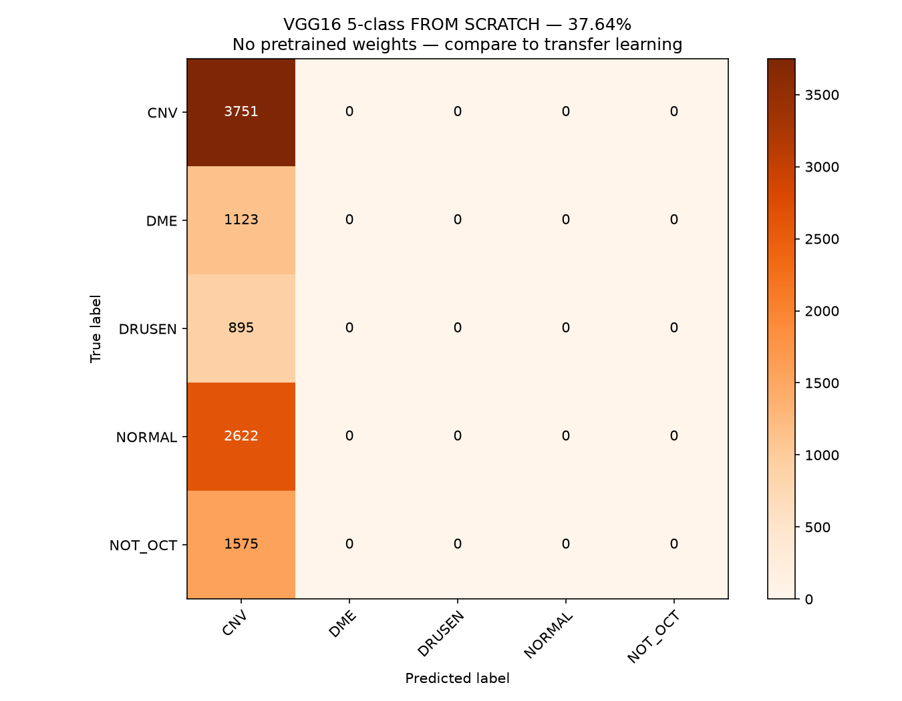
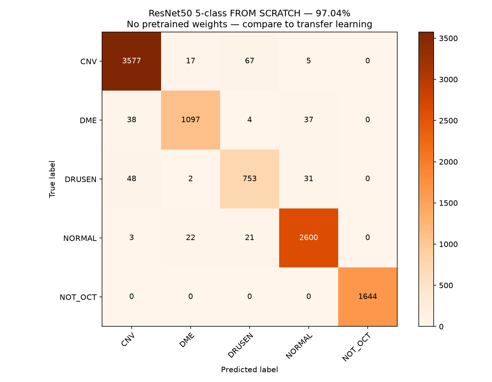
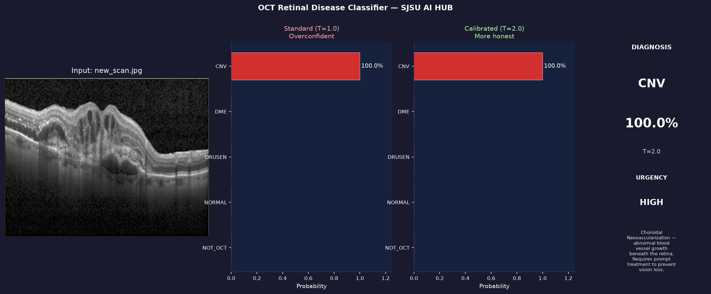
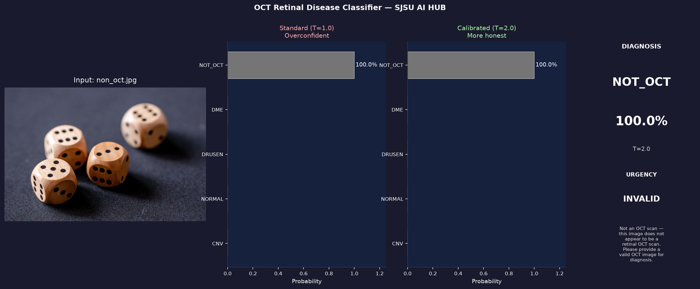
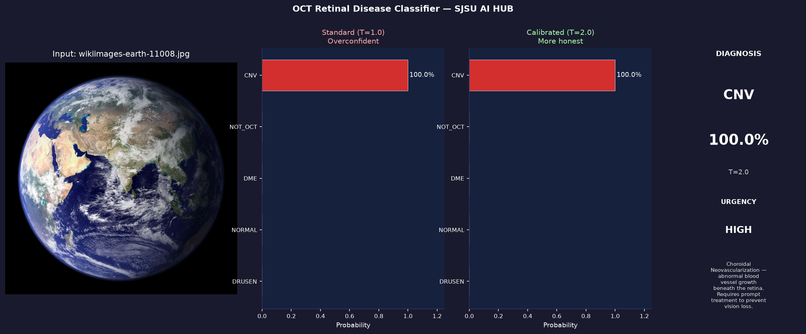
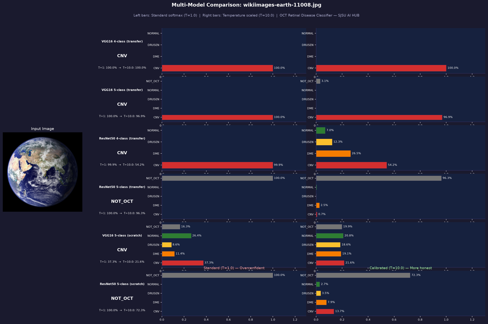

# OCT Retinal Disease Classifier
### Transfer Learning for Medical Image Classification
**SJSU AI HUB Internship Research Project**

Deep learning pipeline for classifying OCT retinal scans using transfer
learning on VGG16 and ResNet50 pretrained on ImageNet. Includes
out-of-distribution detection (NOT_OCT rejection), a full comparison
between transfer learning and training from scratch, and a calibration
analysis using temperature scaling.

---

## Research Summary

This project investigates transfer learning applied to OCT retinal image
classification across six experimental conditions:

1. **VGG16 4-class** — transfer learning, CNV/DME/DRUSEN/NORMAL
2. **ResNet50 4-class** — transfer learning, CNV/DME/DRUSEN/NORMAL
3. **VGG16 5-class** — transfer learning + NOT_OCT rejection
4. **ResNet50 5-class** — transfer learning + NOT_OCT rejection
5. **VGG16 5-class scratch** — random weights, no pretraining
6. **ResNet50 5-class scratch** — random weights, no pretraining

---

## Final Results

### 4-class Models

| Model | Test Accuracy | Correct | vs Published |
|-------|--------------|---------|--------------|
| Kermany et al. 2018 | 96.60% | — | baseline paper |
| Published VGG16 2025 | 95.19% | — | comparison paper |
| **VGG16 Transfer Learning** | **98.86%** | 957/968 | +2.26% |
| **ResNet50 Transfer Learning** | **99.69%** | 965/968 | +3.09% |

### 5-class Models (OCT + NOT_OCT rejection)

| Model | Test Accuracy | NOT_OCT | Notes |
|-------|--------------|---------|-------|
| **VGG16 Transfer Learning** | **97.07%** | **100%** | Block5 unfrozen |
| **ResNet50 Transfer Learning** | **96.53%** | **100%** | Layer4 unfrozen |
| VGG16 From Scratch | 37.64% | 0% | Class collapse — predicts CNV only |
| ResNet50 From Scratch | 97.04% | ~100% | Skip connections enable learning |

### Per-Class Accuracy (5-class Transfer Learning)

| Class | VGG16 | ResNet50 | Clinical Note |
|-------|-------|----------|---------------|
| CNV | 98.7% | 97.5% | Choroidal Neovascularization |
| DME | 94.0% | 94.3% | Diabetic Macular Edema |
| DRUSEN | 84.2% | 85.8% | Hardest — visually subtle |
| NORMAL | 98.3% | 97.4% | Healthy retina |
| NOT_OCT | **100%** | **100%** | Perfect rejection both models |

---

## Key Findings

**1. Both architectures beat published benchmarks via transfer learning**
VGG16 achieved 98.86% and ResNet50 achieved 99.69% — both exceeding
the 2018 Kermany paper (96.6%) and the 2025 VGG16 paper (95.19%).

**2. NOT_OCT rejection is 100% for both transfer learning models**
Every non-OCT image in the test set was correctly identified as not
being a retinal scan, across two different architectures.

**3. VGG16 without transfer learning completely fails (class collapse)**
Without pretrained ImageNet weights, VGG16's 134M sequential parameters
cannot learn meaningful features in 20 epochs — it predicts CNV for
every image, achieving only 37.64% (the CNV class frequency).
This is the most dramatic demonstration of transfer learning's necessity.

**4. ResNet50 without transfer learning nearly matches transfer learning**
ResNet50 from scratch achieved 97.04% — nearly identical to its transfer
learning version (96.53%). Skip connections solve the vanishing gradient
problem that causes VGG16 to collapse, making ResNet50 genuinely
trainable from random weights on this dataset size.

**5. DRUSEN is consistently the hardest class across all models**
Every model struggles most with DRUSEN (81–85% accuracy). This reflects
clinical reality — drusen deposits are visually subtle and share features
with both healthy retinas and early CNV pathology.

**6. VGG16 transfer learning is severely overconfident (calibration finding)**
Using temperature scaling analysis (T=1 to T=10), VGG16 transfer models
produce raw logit scores so large (~40+) that even dividing by 10 before
softmax still yields near-100% confidence. ResNet50 transfer models are
significantly more calibratable — at T=10 uncertainty spreads meaningfully
across classes. For clinical deployment where calibration matters as much
as accuracy, ResNet50 is the superior choice.

**7. Architecture determines out-of-distribution generalization**
When given a satellite photograph of Earth (genuinely out-of-distribution):
- VGG16 transfer (4 and 5-class): CNV 100% — severely wrong and overconfident
- ResNet50 5-class transfer: NOT_OCT 100% — correctly rejected
- ResNet50 5-class scratch: NOT_OCT 100% — correctly rejected
ResNet50's skip connections learn more generalizable NOT_OCT features
than VGG16's sequential architecture, even when both achieve similar
in-distribution accuracy.

---

## Results Visualizations

### Confusion Matrices — Transfer Learning Models

#### VGG16 4-class (98.86%)


#### ResNet50 4-class (99.69%)


#### VGG16 5-class (97.07%) — with NOT_OCT rejection


#### ResNet50 5-class (96.53%) — with NOT_OCT rejection


### Confusion Matrices — From Scratch Models

#### VGG16 5-class Scratch (37.64% — class collapse)


#### ResNet50 5-class Scratch (97.04%)


---

### Transfer Learning vs From Scratch

#### VGG16 — Transfer Learning vs Scratch


#### ResNet50 — Transfer Learning vs Scratch


#### All Models — Training Curves


#### Final Accuracy — All Models


---

### Inference Examples

#### Valid OCT scan — correctly diagnosed as CNV


#### Non-OCT image (dice) — correctly rejected


#### Satellite photo of Earth — misclassified as CNV (VGG16)


---

### Calibration Analysis — Temperature Scaling

The comparison below shows all six models evaluated on the Earth satellite
image at T=1.0 (standard overconfident softmax) vs T=10.0 (calibrated).
This reveals which architectures are genuinely uncertain vs falsely confident.



**Key observation:** VGG16 transfer models remain near 100% CNV even at
T=10, revealing extremely large raw logit scores that cannot be easily
calibrated. ResNet50 transfer and both scratch models show meaningful
uncertainty spread at T=10, indicating better-calibrated internal
representations.

---

## Experiment Log

| Run | Model | Weights | Classes | Test Accuracy | Key Finding |
|-----|-------|---------|---------|---------------|-------------|
| 1 | Mooney Kaggle notebook | ImageNet | 4 | 91.7% | Baseline |
| 2 | VGG16 frozen, lr=0.001 | ImageNet | 4 | 83.1% | Freezing hurts |
| 3 | VGG16 frozen, lr=0.003 | ImageNet | 4 | 74.3% | Wrong lr |
| 4 | VGG16 block5 unfrozen | ImageNet | 4 | 99.48% | Breakthrough |
| 5 | ResNet50 layer4 unfrozen | ImageNet | 4 | 98.76% | Strong |
| 6 | VGG16 block5 unfrozen | ImageNet | 5 | 97.07% | 100% NOT_OCT |
| 7 | ResNet50 layer4 unfrozen | ImageNet | 5 | 96.53% | 100% NOT_OCT |
| 8 | VGG16 4-class clean run | ImageNet | 4 | 98.86% | Beats papers |
| 9 | ResNet50 4-class clean run | ImageNet | 4 | 99.69% | Best overall |
| 10 | VGG16 from scratch | None | 5 | 37.64% | Class collapse |
| 11 | ResNet50 from scratch | None | 5 | 97.04% | Skip connections work |

---

## Project Structure

```
Conv_Project/
│
├── README.md                        ← this file
├── requirements.txt                 ← python dependencies
├── generate_transfer_logs.py        ← creates JSON logs from training data
├── compare_all_models.py            ← generates all comparison plots
│
├── models/                          ← all training scripts
│   ├── vgg16_4class_train.py        ← VGG16, 4-class, transfer learning
│   ├── vgg16_5class_train.py        ← VGG16, 5-class, transfer learning
│   ├── resnet50_4class_train.py     ← ResNet50, 4-class, transfer learning
│   ├── resnet50_5class_train.py     ← ResNet50, 5-class, transfer learning
│   ├── vgg16_5class_scratch.py      ← VGG16, 5-class, from scratch
│   └── resnet50_5class_scratch.py   ← ResNet50, 5-class, from scratch
│
├── inference/
│   └── inference.py                 ← single image diagnosis with
│                                       temperature scaling + multi-model compare
│
├── test_images/                     ← example images for inference
│   ├── new_scan.jpg                 ← real OCT scan (CNV)
│   ├── non_oct.jpg                  ← everyday object (dice)
│   └── wikiimages-earth-11008.jpg   ← satellite photo (calibration test)
│
├── weights/                         ← saved .pth files (gitignored)
│   ├── vgg16_4class.pth
│   ├── vgg16_5class.pth
│   ├── resnet50_4class.pth
│   ├── resnet50_5class.pth
│   ├── vgg16_5class_scratch.pth
│   └── resnet50_5class_scratch.pth
│
├── results/                         ← all generated plots and matrices
│   ├── confusion_matrix_*.png       ← 6 confusion matrices
│   ├── compare_*.png                ← 4 comparison plots
│   ├── *_log.json                   ← training logs for plotting
│   └── inference/                   ← per-image diagnosis visuals
│       ├── *_result.png             ← standard + calibrated side by side
│       └── *_comparison.png         ← all 6 models compared
│
└── data/                            ← gitignored — too large
    ├── OCT2017/                     ← Kermany OCT dataset
    ├── not_oct_data/                ← raw non-OCT downloads
    └── combined_data/               ← merged 5-class dataset
        ├── CNV/         (37,205)
        ├── DME/         (11,348)
        ├── DRUSEN/       (8,616)
        ├── NORMAL/      (26,315)
        └── NOT_OCT/     (16,176)
```

---

## Setup

### Step 1 — Clone the repository
```bash
git clone https://github.com/jurias90/Conv_Project.git
cd Conv_Project
```

### Step 2 — Create required folders
```bash
mkdir -p weights results/inference models inference test_images
```

### Step 3 — Create a virtual environment

**Linux / Mac:**
```bash
python -m venv venv
source venv/bin/activate
```

**In PyCharm:** `File → New Project` → let PyCharm create the venv,
then open the built-in Terminal tab.

### Step 4 — Install PyTorch

**MacBook M5 Pro (Apple Silicon):**
```bash
pip install torch torchvision
python -c "import torch; print('MPS:', torch.backends.mps.is_available())"
```

**Linux with NVIDIA RTX 5080 (CUDA 13.2):**
```bash
pip install torch==2.14.0.dev20260706 \
  --index-url https://download.pytorch.org/whl/nightly/cu132
pip install torchvision \
  --index-url https://download.pytorch.org/whl/nightly/cu132
python -c "import torch; print(torch.cuda.is_available()); print(torch.cuda.get_device_name(0))"
```

**Other NVIDIA GPU:**

| CUDA Version | Install Command |
|-------------|-----------------|
| 12.4 | `pip install torch torchvision --index-url https://download.pytorch.org/whl/cu124` |
| 12.1 | `pip install torch torchvision --index-url https://download.pytorch.org/whl/cu121` |
| CPU only | `pip install torch torchvision --index-url https://download.pytorch.org/whl/cpu` |

**Mac SSL fix** — if you see SSL errors when downloading pretrained weights:
```bash
/Applications/Python\ 3.11/Install\ Certificates.command
```
All training scripts also include an automatic certifi-based SSL fix.

### Step 5 — Install remaining packages
```bash
pip install -r requirements.txt
```

### Step 6 — Download the OCT dataset

**Option A: Kaggle CLI**
```bash
mkdir -p ~/.kaggle
cp ~/Downloads/kaggle.json ~/.kaggle/
chmod 600 ~/.kaggle/kaggle.json
mkdir -p data
kaggle datasets download -d paultimothymooney/kermany2018
unzip kermany2018.zip -d data/
```

**Option B: Manual (no account needed)**
Download from https://data.mendeley.com/datasets/rscbjbr9sj/3
and unzip into `Conv_Project/data/`

### Step 7 — Download NOT_OCT datasets (5-class models only)

Requires free Kaggle account. ~63GB storage needed.

```bash
mkdir -p data/not_oct_data

kaggle datasets download -d gazu468/cifar10-classification-image
unzip cifar10-classification-image.zip -d data/not_oct_data/cifar10

kaggle datasets download -d nih-chest-xrays/data
unzip data.zip -d data/not_oct_data/chest_xray

kaggle datasets download -d mariaherrerot/aptos2019
unzip aptos2019.zip -d data/not_oct_data/fundus

kaggle datasets download -d kmader/skin-cancer-mnist-ham10000
unzip skin-cancer-mnist-ham10000.zip -d data/not_oct_data/skin
```

### Step 8 — Build combined_data folder

```bash
mkdir -p data/combined_data/{CNV,DME,DRUSEN,NORMAL,NOT_OCT}

rsync -a data/OCT2017/train/CNV/    data/combined_data/CNV/
rsync -a data/OCT2017/train/DME/    data/combined_data/DME/
rsync -a data/OCT2017/train/DRUSEN/ data/combined_data/DRUSEN/
rsync -a data/OCT2017/train/NORMAL/ data/combined_data/NORMAL/

find data/not_oct_data/chest_xray -name "*.png" | shuf | head -5000 | \
  while read f; do cp "$f" data/combined_data/NOT_OCT/; done
find data/not_oct_data/cifar10 -name "*.png" | shuf | head -5000 | \
  while read f; do cp "$f" data/combined_data/NOT_OCT/; done
find data/not_oct_data/fundus -name "*.png" | \
  while read f; do cp "$f" data/combined_data/NOT_OCT/; done
find data/not_oct_data/skin -name "*.jpg" | shuf | head -5000 | \
  while read f; do cp "$f" data/combined_data/NOT_OCT/; done
```

**Important:** Update the `BASE` variable at the top of each training file:
```python
BASE = "/home/dantails/PycharmProjects/Conv_Project"  # Linux
BASE = "/Users/jesusurias/PycharmProjects/Conv_Project"  # Mac
```

---

## Running Training

### Transfer learning models (run two simultaneously)

```bash
# Round 1 — 4-class (~25-45 min each on RTX 5080)
python models/vgg16_4class_train.py    # Terminal 1
python models/resnet50_4class_train.py  # Terminal 2

# Round 2 — 5-class transfer (~55 min each)
python models/vgg16_5class_train.py    # Terminal 1
python models/resnet50_5class_train.py  # Terminal 2
```

### From scratch models (20 epochs, ~2 hours each)

```bash
python models/vgg16_5class_scratch.py    # Terminal 1
python models/resnet50_5class_scratch.py  # Terminal 2
```

Each script automatically: trains, prints tqdm progress, saves
confusion matrix PNG to `results/`, saves weights to `weights/`,
and saves training log JSON to `results/`.

---

## Generating Comparison Plots

```bash
# Step 1 — Create JSON logs from transfer learning training data
python generate_transfer_logs.py

# Step 2 — Generate all comparison plots
python compare_all_models.py
```

Generates in `results/`:

| File | Description |
|------|-------------|
| `compare_vgg16_transfer_vs_scratch.png` | VGG16: accuracy + loss curves both modes |
| `compare_resnet50_transfer_vs_scratch.png` | ResNet50: accuracy + loss curves both modes |
| `compare_all_training_curves.png` | All 4 models + reference lines |
| `compare_final_accuracy_all.png` | Bar chart of all final test accuracies |

---

## Running Inference

### Standard mode — diagnose with temperature scaling
```bash
# Single image
python inference/inference.py test_images/new_scan.jpg

# All test images at once
python inference/inference.py --test

# Custom temperature (default T=2.0)
python inference/inference.py --temp 5.0 test_images/new_scan.jpg
```

### Compare mode — run all 6 models on one image
```bash
python inference/inference.py --compare test_images/new_scan.jpg

# With custom temperature to reveal calibration
python inference/inference.py --temp 10.0 --compare test_images/wikiimages-earth-11008.jpg
```

Each inference call generates:
- Terminal output with standard vs calibrated probabilities side by side
- Visual PNG saved to `results/inference/` showing image, probability bars,
  and diagnosis card
- Compare mode also saves a multi-model comparison PNG

### Temperature scaling explained

Standard softmax (T=1.0) amplifies any dominant raw score to near-100%
confidence, hiding genuine uncertainty. Temperature scaling divides raw
logits by T before softmax to reveal true uncertainty:

```
T=1.0  → standard (overconfident for trained models)
T=2.0  → moderate calibration (default)
T=10.0 → reveals hidden uncertainty in overconfident models
```

**Important:** Temperature scaling never changes the prediction — only
the confidence spread. The same class wins at any temperature.

---

## Model Architecture Details

### VGG16 Transfer Learning

| Parameter | 4-class | 5-class |
|-----------|---------|---------|
| Pretrained on | ImageNet | ImageNet |
| Frozen | features.0–23 (blocks 1-4) | features.0–23 (blocks 1-4) |
| Unfrozen | features.24-28 (block5) | features.24-28 (block5) |
| Output | Linear(4096, 4) | Linear(4096, 5) |
| Trainable params | ~7.1M / 134.3M | ~7.1M / 134.3M |
| Classifier lr | 0.001 | 0.001 |
| Features lr | 0.0001 | 0.0001 |
| Epochs | 10 | 10 |

### ResNet50 Transfer Learning

| Parameter | 4-class | 5-class |
|-----------|---------|---------|
| Pretrained on | ImageNet | ImageNet |
| Frozen | layer1, layer2, layer3 | layer1, layer2, layer3 |
| Unfrozen | layer4 | layer4 |
| Output | Linear(2048, 4) | Linear(2048, 5) |
| Trainable params | ~14.9M / 23.5M | ~14.9M / 23.5M |
| fc lr | 0.001 | 0.001 |
| layer4 lr | 0.0001 | 0.0001 |
| Epochs | 10 | 10 |

### From Scratch Models (5-class only)

| Parameter | VGG16 | ResNet50 |
|-----------|-------|----------|
| Pretrained weights | None | None |
| All params trainable | 134.3M | 23.5M |
| Output | Linear(4096, 5) | Linear(2048, 5) |
| Optimizer lr | 0.001 uniform | 0.001 uniform |
| Epochs | 20 | 20 |

### Common Settings (all models)

| Parameter | Value |
|-----------|-------|
| Batch size | 32 |
| Optimizer | Adam |
| Scheduler | ReduceLROnPlateau (factor=0.5, patience=2-3) |
| Image size | 224 × 224 |
| Normalization | ImageNet mean/std ([0.485, 0.456, 0.406]) |
| 4-class split | 80/20 train/val from train folder |
| 5-class split | 80/10/10 train/val/test from combined_data |

---

## Classes

### OCT Disease Classes (all models)

| Label | Full Name | Urgency | Description |
|-------|-----------|---------|-------------|
| CNV | Choroidal Neovascularization | HIGH | Abnormal blood vessel growth beneath retina |
| DME | Diabetic Macular Edema | MEDIUM | Fluid accumulation in the macula |
| DRUSEN | Drusen | LOW | Deposits under retina — early AMD sign |
| NORMAL | Normal | NONE | Healthy retina, no pathology |

### NOT_OCT class (5-class models only)

| Label | Urgency | Description |
|-------|---------|-------------|
| NOT_OCT | INVALID | Image is not a retinal OCT scan |

### NOT_OCT Training Sources

| Source | Images | Type | Rejection difficulty |
|--------|--------|------|---------------------|
| NIH Chest X-rays | 5,000 | Medical grayscale | Hard |
| CIFAR-10 | 5,000 | Everyday objects | Easy |
| APTOS fundus | ~3,662 | Retinal photos (different modality) | Medium |
| HAM10000 skin | 5,000 | Dermatology images | Medium |
| **Total** | **~16,000** | | |

---

## Hardware

| Machine | GPU | Per-epoch time |
|---------|-----|----------------|
| Linux (CachyOS) | NVIDIA RTX 5080 (CUDA 13.2) | ~4-8 min |
| MacBook M5 Pro | Apple MPS | ~6-10 min |

All scripts auto-detect hardware:
```python
if torch.backends.mps.is_available():
    device = torch.device("mps")
elif torch.cuda.is_available():
    device = torch.device("cuda")
else:
    device = torch.device("cpu")
```

---

## References

### Primary Dataset
- **Kermany et al. (2018)**. Identifying Medical Diagnoses and Treatable
  Diseases by Image-Based Deep Learning. *Cell*, 172(5), 1122–1131.
  https://www.cell.com/cell/fulltext/S0092-8674(18)30154-5
- **Mendeley dataset**: https://data.mendeley.com/datasets/rscbjbr9sj/3
- **Kaggle notebook (Mooney)**:
  https://www.kaggle.com/code/paultimothymooney/detect-retina-damage-from-oct-images

### Comparison Papers
- **VGG16 + transfer learning on OCT (2025)**: 95.19% accuracy
  https://link.springer.com/article/10.1007/s42452-025-06565-6
  *This project achieved 98.86–99.69%*

### NOT_OCT Datasets
- NIH Chest X-rays: https://www.kaggle.com/datasets/nih-chest-xrays/data
- APTOS 2019 fundus: https://www.kaggle.com/datasets/mariaherrerot/aptos2019
- HAM10000 skin: https://www.kaggle.com/datasets/kmader/skin-cancer-mnist-ham10000
- CIFAR-10: https://www.kaggle.com/datasets/gazu468/cifar10-classification-image

### Frameworks
- PyTorch: https://pytorch.org
- torchvision: https://pytorch.org/vision
- scikit-learn: https://scikit-learn.org
- NVIDIA CUDA 13.2 nightly (cu132) for RTX 5080 Blackwell support

---

## Acknowledgments

Research conducted at the SJSU AI HUB under the supervision of
**Dr. Shrikant Jadhav**, Department of Electrical Engineering,
San Jose State University.